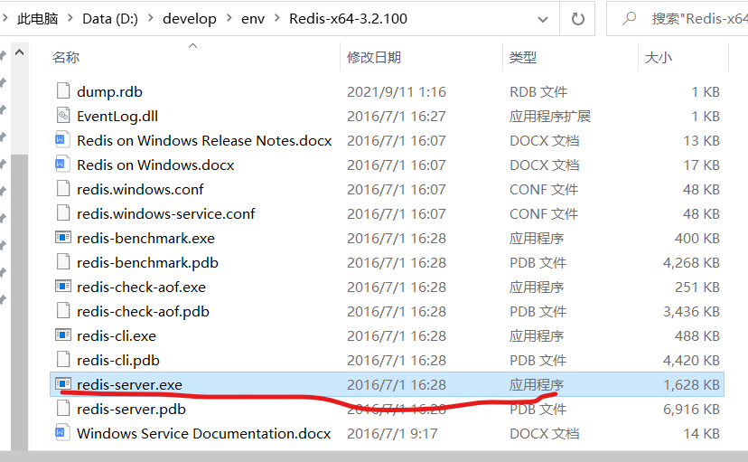

该项目是在Myseckill3上基础上添加高并发优化的实现

## 高并发优化分析

### 哪些模块会发生高并发

- 详情页：用户大量刷新详情页。将详情页部署到CDN上，CDN(内容分发网络)存储静态资源
  - CDN:加速用户获取数据的系统
  - CDN部署在离用户最近的网络节点上，用户通过运营商接口接入，去访问离它最近的城域网的地址，如果没找到，通过城域网去主干网，通过ip访问所在资源的服务器。很大一部分内容都在CDN上，不用往后找(命中CDN不需要访问后端服务器)
  - 静态资源不需要访问后端服务器
- 系统时间：需要优化吗？不需要，因为访问一次内存需要的事件很短。
- 地址暴露接口：无法使用CDN缓存，因为它是动态的。但是它适合服务器缓存，如redis。
  - 请求地址，先访问redis,没有才访问mysql；下一次同一用户访问就可直接获取
  - redis和mysql的一致性维护
    - 超时穿透: 比如缓存一段时间，一段时间超时后直接去mysql中找
    - 主动更新:mysql更新时主动更新redis
- 执行秒杀操作:
  - 无法使用CDN缓存，因为是写操作并且是最核心的请求。
  - 后端缓存困难，如果在redis缓存的话，其它用户也可以拿到这个缓存去减库存，这就有可能导致库存卖超的问题
  - 热点商品 : 一个时刻大量用户同时请求，产生竞争

### 其它方案分析

执行秒杀时，做一个原子计数器(可通过redis/nosql实现), 原子计数器记录的就是商品的库存。当用户执行秒杀的时候，它就减原子计数器。减原子计数器成功后，记录一个行为，也就是记录那个用户执行了这个操作，作为一个消息放在一个分布式的MQ(消息队列，如RabbitMQ), 后端的服务消费消息并落地，记录回mySQL.

该架构可以抗住非常高的并发。分布式的MQ可以支持几十万个qps

 

痛点：

减库存时，不知道用户之前有没有减库存。需要再维护一个NoSQL的访问方案。记录哪些用户减库存了

 


为什么不用MySQL: 会产生大量阻塞，另外还有网络延迟(mysql和tomcat服务器等交互)以及Java的垃圾回收时会停止当前的线程。

优化：

- 因为行级锁在Commit之后释放-->所以优化方向是如何减少行级锁持有时间。
- 如何判断update更新库存成功？在哭护短，要确认update本身没报错以及update影响记录数->优化方向是把客户端逻辑放到mysql服务端，同时避免网络延迟和GC影响
  - 如何放呢？ 
    - 定制SQL方案，需要修改MySQL源码，难
    - 使用存储过程让整个事务在MySQL端完成。

### 优化总结

前端控制：暴露接口，按钮放重复(不能短时间重复按按钮)

动静态数据分离：CDN缓存，后端缓存

事务竞争：减少事务锁时间

## redis后端缓存优化

优化：地址暴露接口，执行秒杀接口

### redis地址暴露接口

#### 搭建Redis

安装redis并启动。

 直接点击redis-server.exe或者命令都可

 

安装服务:`redis-server --service-install redis.windows.conf`

启动服务：`redis-server --service-start`


停止服务: `redis-server --service-stop`

切换到redis目录下运行:`redis-cli.exe -h 127.0.0.1 -p 6379`

 

#### 项目+Redis

引入依赖：jedis客户端

```
<!--    redis客户端:引入jedis依赖-->
    <dependency>
      <groupId>redis.clients</groupId>
      <artifactId>jedis</artifactId>
      <version>2.9.0</version>
    </dependency>
```

#### 缓存优化

暴露接口：SeckillServiceImple类的exportSeckillUrl方法

```java
@Override
public Exposer exportSeckillUrl(long seckillId) {
    /**
     * 这一个地方可以写到这里的逻辑里面，也可以写到dao包下，因为这也是操作数据库，只不过是redis而已
     * 优化点：缓存优化
     * get from cache
     * 如果是null  get db,然后放到cache
     * 不为null  走下面的logis
     */
     }
```

我们写道dao里面，其下新建一个cache包，写一个RedisDao

```
public class RedisDao {
    private Logger logger = Logger.getLogger(RedisDao.class);
    private JedisPool jedisPool;
    public RedisDao(String ip,int port){
        jedisPool = new JedisPool(ip,port);
    }
//    去找seckillId对应的对象
    public Seckill getSeckill(long seckillId){
//        redis操作逻辑
        try{
//            得到连接池
            Jedis jedis = jedisPool.getResource();
            
            try{
                String key = "seckill:"+seckillId;
//                需要序列化操作，对我们要获得的这个对象定义序列化功能
//                get->byte[]->反序列化->Object(Seckill)
                jedis.get();
            }finally {
                jedis.close();
            }
        }catch (Exception e){
            logger.error(e.getMessage(),e);
        }
        return null;
    }
//    如果没有整个对象，就要put进去
    public String putSeckill(Seckill seckill){
        
    }
}
```


序列化声明

```
public class Seckill implements Serializable {
}
```

```
//采用自定义序列化，将对象转化成字节数组，传给redis进行缓存。
```

pom引入依赖才能自己去写序列化

```
<dependency>
  <groupId>com.dyuproject.protostuff</groupId>
  <artifactId>protostuff-core</artifactId>
  <version>1.1.1</version>
</dependency>
<dependency>
  <groupId>com.dyuproject.protostuff</groupId>
  <artifactId>protostuff-runtime</artifactId>
  <version>1.1.1</version>
</dependency>
```


```
public class RedisDao {
    private Logger logger = Logger.getLogger(RedisDao.class);
    private JedisPool jedisPool;
    public RedisDao(String ip,int port){
        jedisPool = new JedisPool(ip,port);
    }

    //基于class做一个模式
    private RuntimeSchema<Seckill> schema = RuntimeSchema.createFrom(Seckill.class);
//    去找seckillId对应的对象
    public Seckill getSeckill(long seckillId){
//        redis操作逻辑
        try{
//            得到连接池
            Jedis jedis = jedisPool.getResource();

            try{
                String key = "seckill:"+seckillId;
//                并没有内部序列化操作
//                get获得byte[]->反序列化->Object(Seckill)
                //采用自定义序列化，将对象转化成二进制数组，传给redis进行缓存。
                //protostuff:pojo
                //把字节数组转化成pojo
                byte[] bytes = jedis.get(key.getBytes());
                if(bytes!=null){
                    Seckill seckill = schema.newMessage();
                    //调用这句话之后seckill就已经被复赋值了
                    ProtostuffIOUtil.mergeFrom(bytes,seckill,schema);
                    return seckill;
                }
            }finally {
                jedis.close();
            }
        }catch (Exception e){
            logger.error(e.getMessage(),e);
        }
        return null;
    }
//    如果没有整个对象，就要put进去
    public String putSeckill(Seckill seckill){
        //Object转化成字节数组
        try {
                Jedis jedis = jedisPool.getResource();
                try {
                    String key = "seckill:"+seckill.getSeckillId();
                    byte[] bytes = ProtostuffIOUtil.toByteArray(seckill, schema, LinkedBuffer.allocate(LinkedBuffer.DEFAULT_BUFFER_SIZE));
//                    超时缓存
                    int timeout = 60*60;//1小时
                    String result = jedis.setex(key.getBytes(), timeout, bytes);
                    return result;
                }finally {
                    jedis.close();
                }
            }catch (Exception e){
                logger.error(e.getMessage(),e);
        }
        return null;
    }

```


测试：

去spring-dao.xml注入Redis

```xml
<!--    RedisDao-->
    <bean id="redisDao" class="com.evelyn.dao.cache.RedisDao">
        <constructor-arg index="0" value="localhost"/>
        <constructor-arg index="1" value="6379"/>
    </bean>
```


```java
@RunWith(SpringJUnit4ClassRunner.class)
@ContextConfiguration({"classpath:spring/spring-dao.xml"})
public class RedisDaoTest {

    private long id = 1001;

    @Autowired
    private RedisDao redisDao;

    @Autowired
    private SeckillDao seckillDao;

    @Test
    public void getSeckill() throws Exception {
        Seckill seckill = redisDao.getSeckill(id);
        if (seckill == null) {
            seckill = seckillDao.queryById(id);
            if (seckill != null) {
                String s = redisDao.putSeckill(seckill);
                System.out.println(s);
                seckill = redisDao.getSeckill(id);
                System.out.println(seckill);
            }
        }
    }
    @Test
    public void putSeckill() {

    }
}
```

 

然后去到我们要优化的那个接口的类，注入RedisDao对象

找到优化的点，加入redis这个内容

```
public Exposer exportSeckillUrl(long seckillId) {
        //优化点：缓存优化，建立在超时的基础上维护一致性。降低对数据库的直接访问量
        //1、当线程将id传入方法时，需要先访问redis
        Seckill seckill = redisDao.getSeckill(seckillId);
        if(seckill==null) {
            //2、没有在redis里面找到就访问数据库
            seckill = seckillDao.queryById(seckillId);
            //数据库里也没有，返回不暴露接口
            if(seckill==null){
                return new Exposer(false,seckillId);
            }else{
                //数据库中找到了，要把当前查找到的对象放到redis里面
                redisDao.putSeckill(seckill);
            }
        }
```


#### 深度优化

事务在MySQL端执行(存储过程)

网络延迟或者客户端上的延迟对于mysql行级锁上的高并发竞争事务来说是性能杀手，要降低行级锁到commit这个过程的时间，让MySql获得更多的qps.

使用存储过程！

```
-- 存储过程
-- 1、存储过程优化：事务行级锁持有的时间
-- 2、不要过度依赖存储过程
-- 3、简单的逻辑可以应用存储过程
```

定义一个存储过程

```Java
-- 秒杀执行存储过程
DELIMITER $$ -- console ;转换为
-- 定义存储参数
-- 参数：in 输入参数；out输出参数
-- rowCount():返回上一条修改类型sql（delete,insert,update）的影响行数
-- rowCount: 0：未修改数据  >0：表示修改的行数 <0：sql错误/未执行修改sql
CREATE PROCEDURE executeSeckill(IN fadeSeckillId INT,IN fadeUserPhone VARCHAR (15),IN fadeKillTime TIMESTAMP ,OUT fadeResult INT)
BEGIN
    DECLARE insert_count INT DEFAULT 0;
    START TRANSACTION ;
    INSERT ignore myseckill.success_killed(seckill_id,user_phone,state,create_time) VALUES(fadeSeckillId,fadeUserPhone,0,fadeKillTime);  -- 先插入购买明细
    SELECT ROW_COUNT() INTO insert_count;
    IF(insert_count = 0) THEN
        ROLLBACK ;
        SET fadeResult = -1;   -- 重复秒杀
    ELSEIF(insert_count < 0) THEN
        ROLLBACK ;
        SET fadeResult = -2;   -- 内部错误
    ELSE   -- 已经插入购买明细，接下来要减少库存
        UPDATE myseckill.seckill SET number = number -1 WHERE seckill_id = fadeSeckillId AND start_time < fadeKillTime AND end_time > fadeKillTime AND number > 0;
        SELECT ROW_COUNT() INTO insert_count;
        IF (insert_count = 0)  THEN
            ROLLBACK ;
            SET fadeResult = 0;   -- 库存没有了，代表秒杀已经关闭
        ELSEIF (insert_count < 0) THEN
            ROLLBACK ;
            SET fadeResult = -2;   -- 内部错误
        ELSE
            COMMIT ;    -- 秒杀成功，事务提交
            SET  fadeResult = 1;   -- 秒杀成功返回值为1
        END IF;
    END IF;
END
$$

DELIMITER ;

SET @fadeResult = -3;
-- 执行存储过程
CALL executeSeckill(1001,13458938588,NOW(),@fadeResult);
-- 获取结果
SELECT @fadeResult;


```

Service接口中加一个方法并实现

```Java
/**
 * 通过存储过程执行秒杀操作
 * @param seckillId 秒杀商品id
 * @param userPhone 用户手机号，这里是作为用户id的作用
 * @param md5 加密后的秒杀商品id,用于生成链接。
 */
SeckillExecution excuteSeckillByProcedure(long seckillId, long userPhone, String md5);
```

SeckillDao加一个操作数据库的方法，调用存储过程

```
void killByProcedure(Map<String,Object> paramMap);
```

```
!--    mybatis调用存储过程-->
    <select id="killByProcedure" statementType="CALLABLE">
        call executeSeckill(
            #{seckillId,jdbcType=BIGINT,mode=IN},
            #{phone,jdbcType=BIGINT,mode=IN},
            #{killTime,jdbcType=TIMESTAMP,mode=IN},
            #{result,jdbcType=INTEGER,mode=OUT}
        )
    </select>
```

测试

```java
@Test
public void excuteSeckillByProcedure() {
    long id = 1001;
    Exposer exposer = seckillService.exportSeckillUrl(id);
    if (exposer.isExposed()) {
        logger.info("exposer: " + exposer);
        String md5 = exposer.getMd5();
        long phone = 13458938588L;
        SeckillExecution seckillExecution = seckillService.excuteSeckillByProcedure(id, phone, md5);
        logger.info(seckillExecution.getStateInfo());
    }
}
```

controller下也同步修改调用方法。

## 部署

系统用到的服务：

CDN

webserver:Nginx+Tomcat/Jetty

Redis:热点数据快速存储

Mysql事务：一致性

### 大型系统部署架构是怎样的？

1、一部分流量被CDN拦截。

2、不适合放到CDN缓存中的请求放到自己的服务器。DNS查找Nginx服务器，Nginx部署到不同的机房，智能DNS通过用户请求的IP作地址解析请求最近的Nginx服务器。同时Nginx服务器可以帮servlet作负载均衡。逻辑机器存放代码。逻辑集群要使用缓存级群。

如果项目非常庞大，会按照关键的id(秒杀id)分库分表。

 3、统计分析